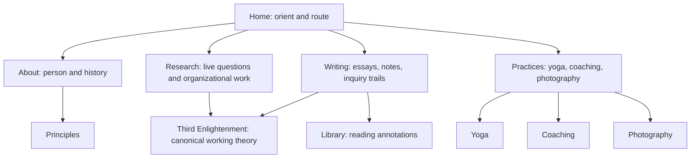
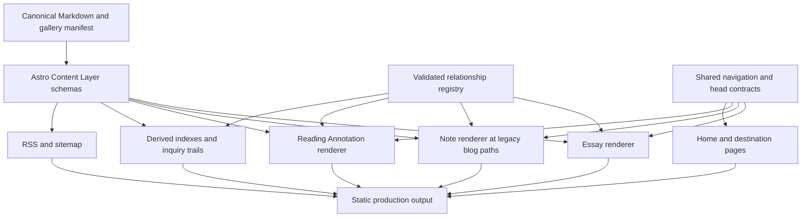
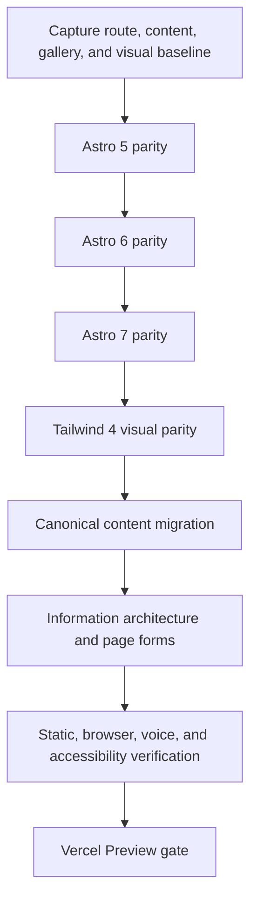
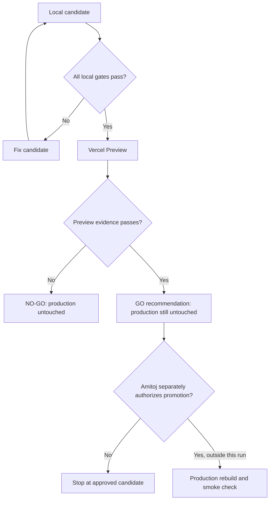

# Site as One Mind - Plan

## Goal Capsule

- **Objective:** A first-time visitor can understand Amitoj's central inquiry, see how his research and practices belong to one life, and choose a meaningful path without reverse-engineering a résumé, services menu, or private vocabulary.
- **Means:** Modernize the unsupported runtime first, then rebuild the information architecture and public copy around one mind expressed through distinct practices, consolidate editorial sources, connect the knowledge archive through inquiry trails, and complete the technical trust baseline (KTD1-KTD9).
- **Product authority:** Amitoj delegated the combination of directions and the product choices through a final Vercel go/no-go gate. The branch may produce a Vercel preview; production deployment requires the final gate.
- **Open blockers:** Formspree account settings and intended-recipient delivery are not observable without an authorized synthetic canary; the candidate can still be built and reviewed, but an unverified transport yields `NO-GO`. Unknown current availability is omitted rather than guessed.
- **Execution profile:** Deep code plan with eight dependency-ordered units. Preserve behavior at the runtime checkpoint, preserve content at the migration checkpoint, then change information architecture and voice.
- **Stop conditions:** Do not remove an old content source before its migration evidence passes. Do not publish unverified dates, availability, claims, or “Where You Are.” Do not promote a production deployment in this run.
- **Tail ownership:** The autonomous pipeline owns implementation, review, pull request, CI, Vercel Preview verification, and the written go/no-go recommendation. Amitoj retains production-promotion authority.

---

## Product Contract

### Summary

The site will present one recurring inquiry across research, writing, reading, yoga, coaching, organizational work, and photography.
Home will orient and route; each destination will take its own truthful form; Third Enlightenment will hold one evolving theory rather than serve as a repeated slogan.

### Problem Frame

The current site contains strong essays, a substantial reading archive, a restrained visual language, and a useful awareness-and-agency premise.
Its breadth becomes difficult to read because the homepage classifies practices without completing the handoff, Work is missing from global navigation, About mixes biography with services and theory, and several pages restate incompatible summaries of Third Enlightenment.

The public voice is strongest when a concrete problem earns a claim and the point of uncertainty remains visible.
It weakens when biography becomes résumé compression, theory becomes symmetrical doctrine, or a practice becomes a generic offer.
The publishing system compounds the problem because rendered pages, parallel source files, hard-coded essay metadata, and the Library index can disagree.

### Key Decisions

- **One mind, many practices.** (session-settled: user-directed — chosen over executing one isolated improvement: Amitoj asked for the combination that produces the best whole-site reflection.) Governs R1-R11.
- **Use a middle-altitude inquiry as the spine.** The site asks how people and organizations notice what matters, find direction, and preserve judgment; Third Enlightenment is one live theory within that inquiry. Governs R1, R5, R8.
- **Design for an intelligent stranger first.** Existing colleagues, prospective collaborators, students, and practice participants remain supported without turning the site into a funnel. Governs R1, R4, R6, R10.
- **Keep the homepage stable.** A current inquiry may appear as a maintained feature, but the site's identity will not depend on seasonal replacement. Governs R1-R3.
- **Preserve the existing visual character.** The oat, sage, ink, Garamond, photography, and quiet pacing remain the family resemblance while page forms become more distinct. Governs R9-R11, R20.
- **One public object has one canonical editable source.** Derived indexes and excerpts may render from that source; parallel authoring copies are retired. Governs R12-R17.
- **Production is a gated decision.** A successful preview is evidence for the gate, not permission to promote. Governs R24.

### Actors

- A1. **First-time reader:** Arrives with little context and wants to understand who Amitoj is, what he is working on, and where to begin.
- A2. **Returning reader:** Enters through an essay, note, search result, or book annotation and wants a useful next connection.
- A3. **Potential collaborator or participant:** Wants to determine whether a research conversation, organizational problem, coaching relationship, yoga practice, or photography inquiry has a truthful opening.
- A4. **Amitoj as author:** Needs one maintainable place to update each claim, object, practice, and current fact.
- A5. **Search, social, and assistive systems:** Need complete metadata, semantic structure, useful descriptions, and predictable routes.

### Requirements

**Orientation and navigation**

- R1. The first homepage viewport must establish Amitoj as a researcher with a prior investing and advisory background whose work moves between organizational judgment and embodied attention, state the recurring inquiry in ordinary language, and offer a clear next move without résumé-stack or consulting-tagline cadence.
- R2. Global navigation must expose About, Research, Writing, Library, Practices, and Contact; Principles, Third Enlightenment, Yoga, Coaching, and Photography remain discoverable through their owning sections and footer.
- R3. The awareness-and-agency map must route to four recognized paths: Yoga for inward awareness, Research for outward awareness, Coaching for inward agency, and organizational work for outward agency.
- R4. Every path selected from Home must land where the first heading or paragraph acknowledges that path and supplies one relevant next step.
- R5. Photography must remain visible as a practice of attention without being forced into a matrix cell that does not describe it.

**Page jobs and public voice**

- R6. About must hold the person, factual history, and connective inquiry; it must not duplicate the theory page or function as a services menu.
- R7. Research must show live academic questions, public artifacts, relevant investing experience, and a specific collaboration threshold; existing `/work` links must remain valid.
- R8. Third Enlightenment must be the sole full explanation of that framework and must distinguish observation, current claim, limits, and a named unresolved question.
- R9. Practices must route to Yoga, Coaching, and Photography, with each page using the editorial form native to its evidence rather than a shared marketing template.
- R10. Yoga and Coaching must state only verified methods, boundaries, and availability; an unknown or closed status must never be disguised as generic “contact for details” copy.
- R11. All first-person public copy must derive its claims from concrete evidence, expose uncertainty at the load-bearing joint, and exclude capability-card rhetoric, repeated slogans, generic calls to action, and fabricated biography or outcomes.

**Knowledge paths and editorial authority**

- R12. Every Essay, Note, Reading Annotation, recurring framework, biographical fact, and practice description must have one canonical editable source.
- R13. Essays, Notes, and Reading Annotations must remain visibly distinct editorial forms with their own labels, metadata, indexes, and detail-page treatment.
- R14. The complete substance of the 38 existing Library annotations must survive consolidation, with any intentional editorial cuts reviewed rather than mechanically dropped.
- R15. Writing must publish at least three maintained inquiry trails, each joining a question to at least one Essay, one Note or theory page, and two relevant Reading Annotations.
- R16. Detail pages for Essays, Notes, and Reading Annotations must provide at least one editorially justified continuation and one page-specific account of how the object bears on the site's recurring inquiry or a relevant research/practice context, rather than only a generic index, slogan, or contact link.
- R17. “Where You Are” must be preserved as draft source, reviewed against the website voice contract, and published only if its claims and final form pass that review.

**Technical trust and release safety**

- R18. Every public route must emit a canonical URL, page-specific title and description, appropriate social-sharing metadata, and valid indexability behavior; the site must expose RSS, sitemap, and robots discovery.
- R19. Navigation, menus, forms, images, headings, focus behavior, and reduced-motion behavior must work with keyboard and assistive technology, including Escape and focus handling for the mobile menu, meaningful image descriptions, and validation, submitting, success, and failure states for any retained form.
- R20. Desktop and mobile layouts must preserve the current visual character while remaining readable without hover, horizontal scrolling, clipped text, or template-shaped repetition.
- R21. Existing public URLs must remain valid through retained routes or intentional redirects, and every internal link must resolve on the production build and Vercel preview.
- R22. Public pages must contain no placeholder copy, stale deployment language, empty galleries, artificial dates, or current-status claims that cannot be verified.
- R23. A fresh dependency install and production build must be reproducible from the repository instructions without relying on the primary checkout's uncommitted files.
- R24. The release must stop at a written Vercel go/no-go decision after preview verification; production promotion occurs only after a “go.”

### Key Flows

- F1. First visit
  - **Trigger:** A1 lands on Home without prior context.
  - **Steps:** The reader encounters the person and central inquiry, selects an awareness-or-agency path or a primary navigation destination, and arrives on a page that recognizes the selection.
  - **Outcome:** The reader can describe the site's connective thread and knows where to continue.
  - **Covered by:** R1-R5.
- F2. Inquiry-led reading
  - **Trigger:** A1 or A2 enters through Writing, a search result, or a detail page.
  - **Steps:** The reader identifies the object's editorial form, follows a question-led trail or related continuation, and moves between argument, observation, theory, and reading evidence without losing context.
  - **Outcome:** The archive reads as thought developing rather than unrelated inventory.
  - **Covered by:** R12-R17.
- F3. Practice inquiry
  - **Trigger:** A3 wants to understand Yoga, Coaching, Photography, or organizational work.
  - **Steps:** The reader enters through Practices or the homepage map, sees the method and honest boundary for that practice, and reaches Contact only when an appropriate next step exists.
  - **Outcome:** The reader understands fit without encountering an invented offer or generic funnel.
  - **Covered by:** R7, R9-R11.
- F4. Authoring and publication
  - **Trigger:** A4 updates a fact, publishes an object, or changes a practice's availability.
  - **Steps:** Amitoj edits the canonical entry or shared fact, previews its derived indexes, page summaries, and related paths, runs the production build, and checks the Vercel preview.
  - **Outcome:** One edit changes every intended surface without parallel-copy drift.
  - **Covered by:** R12-R18, R23.
- F5. Release gate
  - **Trigger:** The candidate branch is complete on a Vercel preview.
  - **Steps:** Build, route, content, voice, accessibility, responsive, metadata, and performance evidence are assembled into a go/no-go report.
  - **Outcome:** A failed gate produces a no-go with named fixes; a passed gate permits a separate production promotion.
  - **Covered by:** R18-R24.

### Acceptance Examples

- AE1. **Covers R1-R4.** Given a reader who knows only Amitoj's name, when they spend thirty seconds on Home and choose Coaching, then they can identify him as a researcher with an investing/advisory background whose work crosses organizational judgment and embodied attention, state the central inquiry, and land on a page whose opening is specifically about coaching rather than a general biography.
- AE2. **Covers R5, R9.** Given a reader interested in Photography, when they use Practices or the footer, then they reach a gallery/contact-sheet form without Photography being described as consulting or forced into an unrelated quadrant.
- AE3. **Covers R8, R11.** Given a Yoga or About page that refers to Third Enlightenment, when the reference is rendered, then it contributes a local observation and links to the canonical theory instead of restating First/Second/Third.
- AE4. **Covers R10, R22.** Given that current class or coaching availability is unknown, when the page is published, then it omits a schedule or marks availability as unconfirmed rather than claiming an offering.
- AE5. **Covers R12-R17.** Given a published “Where You Are” Essay, when its title, description, or related trail changes at the canonical source, then Writing and every derived continuation reflect the same values after one build.
- AE6. **Covers R14-R16.** Given any existing Reading Annotation, when consolidation is complete, then its recommendation, argument, passages, and read-or-skip guidance remain available and at least one useful continuation is present.
- AE7. **Covers R19-R20.** Given a keyboard-only reader at a narrow viewport, when they open the mobile menu, move through links, press Escape, and resume reading, then expansion state, focus, and visibility remain coherent without hover.
- AE8. **Covers R18-R21.** Given an old `/work` link or a shared detail URL, when it is requested on the preview, then it resolves to the intended current destination with correct canonical and social metadata.
- AE9. **Covers R23-R24.** Given any failing build, broken route, serious accessibility issue, unresolved placeholder, or material voice defect, when the release report is written, then the decision is no-go and production is not promoted.

### Success Criteria

- An independent fresh-context reader can answer “Who is Amitoj?”, “What question connects this site?”, and “Where would I go next?” after a thirty-second homepage review, with the verbatim answers retained as release evidence.
- A cross-page copy audit finds no full Third Enlightenment restatement outside its canonical page and no generic service menu or placeholder availability language.
- An independent website voice review returns “Matches” or “Matches with tuning”; “sounds right, thinks wrong,” “wrong altitude,” and “does not match” block release.
- All 38 existing Library annotations retain their substantive content; every Essay, Note, and Reading Annotation has one canonical editable source; and repeated biography/practice claims derive from the typed facts registry.
- A fresh install and production build finish without errors; automated link checking finds no unintended broken internal routes.
- Browser verification passes the primary flows at representative desktop and mobile widths, including keyboard navigation and menu state.
- Automated accessibility testing reports zero serious or critical issues on representative page types.
- Representative Lighthouse runs reach at least 90 Performance and 95 Accessibility, Best Practices, and SEO, or the go/no-go report documents and resolves the exception.
- The Vercel preview matches the candidate commit and the final report records a single go/no-go recommendation with supporting evidence.

### Scope Boundaries

**Deferred for later**

- A full-text Library search, personalization, saved reading lists, and automated recommendations.
- A CMS, newsletter delivery system, booking calendar, ecommerce, user accounts, or analytics experimentation.
- Rewriting every Reading Annotation; this release preserves and connects them while fixing only release-blocking defects.

**Outside this product's identity**

- A consulting-firm services catalogue, lead-qualification funnel, synthetic testimonials, or invented case studies.
- A chatbot that speaks as Amitoj or summarizes his views without source boundaries.
- A social-feed homepage or seasonal identity that becomes stale unless it is continuously refreshed.
- Decorative motion, branding spectacle, or template variety that competes with the reading experience.

### Dependencies / Assumptions

- Existing factual biography and professional-history claims are treated as source material, but time-sensitive status and availability require direct evidence or omission.
- The uncommitted homepage matrix, “Where You Are” draft, and their design records are intentional candidates to reconcile; generated mockups, review artifacts, PDF output, file-mode noise, and local tool history are not product inputs.
- Existing photography is owned and publishable; descriptions and captions still require editorial verification.
- The current contact transport remains acceptable unless planning finds a reliability, privacy, or accessibility blocker.
- Vercel preview access is available before the release gate; lack of access produces a no-go rather than an inferred production state.

### Outstanding Questions

**Resolve Before Planning**

- None.

**Deferred to Planning**

- Choose the lowest-risk canonical content model and migration sequence that satisfies R12-R17 without losing route history or Library substance.
- Decide whether the existing Astro version should remain pinned or be upgraded based on current support, dependency health, and release risk.
- Select the static social image treatment and representative automated verification tools.

### Sources / Research

- `src/pages/index.astro`
- `src/layouts/Layout.astro`
- `src/pages/about.astro`
- `src/pages/work.astro`
- `src/pages/writing.astro`
- `src/pages/library/index.astro`
- `src/pages/third-enlightenment.astro`
- `src/pages/principles.astro`
- `src/pages/yoga.astro`
- `src/pages/photography.astro`
- `src/pages/contact.astro`
- `src/content/config.ts`
- `content-source/essays/where-you-are.md`
- `docs/plans/2026-03-02-voice-revision-design.md`
- `README.md`
- [Maggie Appleton](https://maggieappleton.com/)
- [Robin Sloan](https://www.robinsloan.com/)

---

## Planning Contract

### Product Contract Preservation

Product Contract preserved, with review-driven clarifications to R1, R16, R19, and AE1 that make the already-stated identity, deep-entry, and form-state outcomes testable. Planning adds implementation choices and an explicit production-promotion boundary without expanding the product's identity or deferred scope.

### Key Technical Decisions

- KTD1. **Upgrade the runtime before changing the product.** Move to Astro 5, replace the deprecated Tailwind integration with Tailwind 4 through its Vite plugin as its own checkpoint, then move through Astro 6 and 7. Every checkpoint is a hard clean-install, generated-output, and representative browser-parity stop; no framework and styling migration share a checkpoint. U1 makes only the minimum collection compatibility adaptations needed to preserve the existing blog schema, paths, routes, and publication semantics; U2 owns the final Content Layer model. Pin Node 24 and TypeScript 5.9 across local, CI, and Vercel builds. Astro 4 is outside support; an uncleared required checkpoint stops implementation and produces a named no-go rather than moving the redesign onto an unsupported or partly migrated runtime. Covers R20, R23 and AE9.
- KTD2. **Make current production the public baseline and the branch point the source baseline.** Resolve and record the current Production deployment and source commit, capture its public output, and separately bind the checked-out branch-point source ledger. Reconcile the intentional uncommitted homepage matrix and every production-to-source difference into an owned fixture or source change before runtime work. Inventory exact URLs, publication states, gallery paths and order, metadata, response headers, required semantic structure, asset identities, and rendered-content fingerprints. Fingerprints preserve ordered headings, paragraphs, lists, blockquotes, link destinations, and embedded assets after entity and whitespace normalization; renderer-only differences require a per-entry diff and reviewer. The current `.astro` detail pages outrank stale `content-source/` copies when they disagree. U2 compares migration against the reconciled baseline; later voice edits compare against the post-U2 canonical checkpoint. Any live editorial or asset drift detected before U8 forces reconciliation or a baseline refresh. Replacement routes and removal of conflicting route files land atomically; non-runtime parallel sources are retired only after exact-set, no-import, slug, semantic-structure, fingerprint, uniqueness, and orphan checks pass. Covers R12-R14, R17, R21, R23 and AE5-AE6.
- KTD3. **Use three local Astro Content Layer collections plus one typed facts registry.** Essays, Notes, and Reading Annotations live in distinct local Markdown collections with form-specific schemas, required explicit public slugs, and explicit publication status that defaults to draft. A small typed registry owns only biographical facts and reusable practice method, boundary, and status claims consumed by more than one page. Dynamic route templates retain `/essays/:slug`, `/blog/:slug`, and `/library/:slug`; drafts are absent from routes, indexes, relations, feeds, and the sitemap. Covers R12-R17, R21 and F2, F4.
- KTD4. **Keep editorial relationships explicit and validated.** Entry frontmatter owns each detail page's continuation links. A typed inquiry-trail registry owns at least three question-led paths and validates every target against a union of published collection objects and explicitly registered canonical static routes such as Third Enlightenment. Missing, draft, or unregistered targets fail verification instead of silently dropping a link. Covers R15-R16 and AE5-AE6.
- KTD5. **Preserve one visual system while giving each practice its native form.** Shared primitives keep the oat, sage, ink, EB Garamond, 65ch prose, restrained borders, and quiet pacing. Home acts as orientation; Research acts as a question-and-artifact docket; Yoga and Coaching state method and boundaries; Photography remains a contact sheet; Third Enlightenment reads as a working theory. Covers R1-R11, R20 and F1, F3.
- KTD6. **Drive navigation and head metadata from shared contracts.** One navigation model renders desktop, mobile, and footer variants. One typed head component derives canonical, Open Graph, Twitter, article, RSS, and sitemap metadata. Use one verified static sharing image (`public/images/profile.jpeg`) with meaningful alt text for every route; page-specific title and description carry the local signal, and per-page image generation is out of scope. Use `https://www.amitoj.co` as the canonical origin only after U1 records the current apex response and `Location` header that establish `www` as authoritative. Covers R2, R4, R18-R21 and AE7-AE8.
- KTD7. **Preserve public paths and use real HTTP redirects.** Keep all existing detail paths and `/blog` Note URLs. Route outward awareness to `/research` and outward agency to `/research#organizational-work`. Co-land `/work` with Research and `/essays` with removal of the legacy index, using one-hop permanent Vercel redirects and one no-trailing-slash policy. Covers R3-R4, R7, R18, R21 and AE1, AE8.
- KTD8. **Make verification layered, early, and reproducible.** U1 establishes the minimal clean-install, static-output, representative Playwright, runtime-pinned CI harness, and current-production Lighthouse medians; every later unit extends it before changing the surface it protects. Static checks cover every generated page, route, relation, fragment, asset, canonical, feed, and exact-set preservation invariant. Playwright and axe exercise representative route forms against production output at desktop and 320px. Browser dogfooding, keyboard, accessibility-tree and available VoiceOver smoke checks, a fresh-context orientation read, and repeated Lighthouse runs provide independent release evidence. Performance must not regress against recorded production medians and targets 90 Performance plus 95 Accessibility, Best Practices, and SEO; an unmet target is named separately from a regression. U8 aggregates release evidence rather than introducing foundational verification for the first time. Covers R18-R24 and F5.
- KTD9. **Bind preview evidence to one immutable candidate and separate it from production authority.** Define the candidate as source commit, lockfile and configuration, declared runtime/environment revision, and exact Vercel deployment ID and immutable URL. Any later change invalidates affected evidence and requires a new Preview gate; the committed report may record a pre-report evidence artifact and its hash while the final PR comment records the report-bearing commit, avoiding a self-invalidating cycle. Every hard gate reports `PASS`, `FAIL`, `BLOCKED`, or `NOT APPLICABLE` with timestamp, owner, expected and observed signal, and evidence location; any failed, blocked, or missing hard gate yields `NO-GO`. Even `GO` leaves production untouched until Amitoj explicitly authorizes promotion. Covers R24 and AE9.

### Assumptions

- Modern evergreen browsers that satisfy Tailwind 4's published browser floor are sufficient; legacy-browser support is not inferred.
- Existing public biography and practice history are usable source evidence. Time-sensitive availability, response-time promises, and artificial publication dates are removed unless independently verified.
- The 52 optimized photographs remain publishable. Their exact current path set, asset identities, and lexicographic order form a one-to-one preservation baseline; an explicit manifest will own inclusion, order, alt text, and optional captions without permitting a missing, orphaned, or duplicated image.
- The existing Formspree endpoint remains the candidate contact transport. The form minimizes its payload, tells visitors that Formspree processes the message, discourages sensitive information, and links to the provider's current privacy terms. Browser tests cover native/client validation, submitting, success, failure, retry, duplicate-submit prevention, and retained input. HTML field limits plus a honeypot provide client-side friction; provider-side domain restriction, spam filtering, quota state, endpoint ownership, active state, Preview-origin/security compatibility, and intended-recipient delivery require account evidence and an explicitly authorized synthetic canary. Without that authorization or evidence, the transport is `BLOCKED` and the report is `NO-GO` unless Amitoj explicitly accepts the named exception.
- Vercel's Git integration will create a Preview deployment for the branch or pull request. Failure to obtain an immutable ready Preview is a no-go.
- Current production security headers are a non-regression baseline. Any repository-owned Vercel configuration must preserve or strengthen them while accommodating self-hosted assets, analytics, and Formspree.
- U1 remains part of the single redesign candidate rather than a separately promoted release: the requested outcome is one rebuilt site, production promotion is outside this run, and keeping one candidate avoids creating an interim production state the user did not request.

### High-Level Technical Design

The following diagrams are directional guidance for boundaries and ordering; KTDs and unit contracts remain authoritative.

### Sequencing

1. Resolve current Production deployment provenance; establish separate immutable public-output and source baselines for route, content, gallery, response-header, metadata, visual, apex-redirect, and Lighthouse evidence; reconcile the intentional homepage matrix; and add the minimal CI/browser harness that protects them.
2. Complete runtime modernization without product changes in the order Astro 5, Tailwind 4, Astro 6, Astro 7, treating each checkpoint as a hard stop on unexplained generated-output drift.
3. Introduce canonical editorial sources and replacement renderers, switch consumers, prove exact-set parity, then retire obsolete routes and parallel authoring copies behind a separate preservation gate.
4. Build inquiry trails and derived indexes on the canonical collections.
5. Harden the shared shell with navigation entries only for routes that already exist; co-land later destinations with their nav/footer entries and redirects.
6. Recompose identity, research, and practice pages using the website voice contracts while extending their tests in the same unit.
7. Run independent voice, browser, accessibility, performance, and immutable-Preview gates, then write a fully evidenced `GO` or `NO-GO` without promoting production.

### System-Wide Impact

- **Authoring:** Amitoj edits each Essay, Note, and Reading Annotation once in its collection entry and each reusable biography/practice claim once in the typed facts registry. Derived indexes, trails, feeds, detail metadata, and page summaries update from those sources.
- **Routes:** Existing detail URLs remain stable. `/work` becomes a permanent redirect after `/research` exists; `/essays` becomes an HTTP redirect to `/writing`.
- **Build:** Node 24, Astro 7, Tailwind 4, content validation, static crawl checks, and browser tests become part of the reproducible release surface.
- **Search and sharing:** Canonicals switch from the incorrect apex configuration to the live `www` origin. Published pages enter sitemap/RSS; Preview pages keep production canonicals and Vercel `noindex` headers.
- **Accessibility:** The navigation disclosure, focus visibility, reduced motion, filters, forms, image alternatives, headings, and narrow-layout behavior become shared contracts rather than page-local fixes.
- **Operations:** Vercel configuration gains trailing-slash and redirect rules. Existing production security headers must not regress.

### Risks and Mitigations

- **Runtime and styling regressions:** Sequential major checkpoints isolate the first failing upgrade. Full route, content, asset, metadata, header, and generated-output parity is the hard stop; screenshots supplement rather than substitute for preservation proof.
- **Content loss or silent drift:** Separate machine-readable public-output and source baselines record Production provenance, exact public slug/path sets, publication state, ordered semantic structure, links, embedded assets, gallery order, asset identity, and rendered-content fingerprints. “Where You Are” is tracked separately so publication cannot mask loss of an existing Essay. Migration exceptions carry a per-entry diff and reviewer; later prose edits compare to the post-U2 canonical checkpoint. U8 re-captures live route/slug state so an intervening production edit cannot disappear behind a stale green gate.
- **Route or canonical loss:** A generated route ledger, one-hop redirect map, link-and-fragment crawl, and self-canonical assertions cover old and new entry paths.
- **Voice homogenization:** Mechanical migration preserves prose byte-for-byte where possible. Substantive first-person edits happen later under `writeastoj` and altitude review, followed by an independent `voice-match` verdict.
- **Fabricated current state:** Unknown availability and dates are omitted. Fact-sensitive claims that cannot be traced to the existing public site remain unpublished.
- **Gallery performance:** Preserve every image while loading below-the-fold work lazily, declaring dimensions, and checking representative gallery Lighthouse medians.
- **False accessibility confidence:** Axe results are paired with keyboard, 400% zoom/reflow, reduced-motion, accessibility-tree inspection, and VoiceOver/Safari smoke checks when the environment exposes them; unavailable manual technology is named rather than fabricated.
- **Contact side effects, privacy, and false confidence:** Browser tests mock every form state; no live inquiry is sent without explicit authorization. The public form minimizes fields, discloses third-party processing, rejects oversized input, uses a honeypot, and never stores release evidence containing visitor or recipient data. Mocked UI evidence never proves provider restrictions, spam controls, quota, ownership, origin policy, or delivery, so an unauthorized or unavailable synthetic canary leaves the hard transport gate blocked.
- **Preview blind spots:** A Preview must be immutable, ready, and matched to the candidate commit, runtime, lockfile, configuration, and deployment record. Redirect tests must stay on the same Preview host, make one server-side hop, and end at a self-canonical destination; no Preview host may leak into canonical, social, sitemap, RSS, or internal-link output. A missing Preview, absent `noindex`, or unverifiable behavior is a no-go.
- **Production-only blind spots:** Preview cannot prove custom-domain DNS/TLS, apex redirects, Production environment variables, CDN/cache/header behavior, analytics, or production-origin form delivery. A `GO` recommends only the exact candidate; a separate authorized promotion owns those smoke tests and monitoring.

### Documentation and Operational Notes

- Replace the stale README with the actual Node, install, content-authoring, verification, and Vercel Preview workflow.
- Preserve machine-readable public-output, source, response-header, route/content, and post-migration canonical baselines under test fixtures, without committing secrets or personal submission data.
- Write the final gate to `docs/releases/2026-08-23-site-as-one-mind-go-no-go.md` with status, provenance, local and Preview evidence, and a machine-readable evidence hash; publish the report-bearing commit separately without pretending it is the already verified candidate.
- Before any production authorization, rollback means rejecting or reverting the candidate while current production remains untouched. Record the last known-good production deployment as the future rollback target; preserving edits authored later against the new canonical model belongs to the separate promotion/rollback action.
- Production promotion and the required custom-domain, environment, headers/cache, analytics, and contact-delivery smoke checks are a separate authorized action.

### Sources and Research

- `package.json`
- `package-lock.json`
- `astro.config.mjs`
- `tailwind.config.mjs`
- `src/content/config.ts`
- `src/layouts/Layout.astro`
- `src/pages/blog/[...slug].astro`
- `src/pages/library/index.astro`
- `src/pages/photography.astro`
- `scripts/mobile-preview.mjs`
- `docs/plans/2026-03-02-voice-revision-design.md`
- [Astro upgrade policy and current release](https://docs.astro.build/en/upgrade-astro/)
- [Astro v5 upgrade guide](https://docs.astro.build/en/guides/upgrade-to/v5/)
- [Astro v6 upgrade guide](https://docs.astro.build/en/guides/upgrade-to/v6/)
- [Astro v7 upgrade guide](https://docs.astro.build/en/guides/upgrade-to/v7/)
- [Astro Content Collections](https://docs.astro.build/en/guides/content-collections/)
- [Astro sitemap integration](https://docs.astro.build/en/guides/integrations-guide/sitemap/)
- [Astro RSS recipe](https://docs.astro.build/en/recipes/rss/)
- [Astro static deployment on Vercel](https://docs.astro.build/en/guides/deploy/vercel/)
- [Vercel redirects](https://vercel.com/docs/project-configuration/vercel-json#redirects)
- [Vercel Git deployments](https://vercel.com/docs/git)
- [WAI disclosure navigation](https://www.w3.org/WAI/ARIA/apg/patterns/disclosure/examples/disclosure-navigation/)
- [WCAG reflow](https://www.w3.org/WAI/WCAG21/Understanding/reflow)
- [Playwright accessibility testing](https://playwright.dev/docs/accessibility-testing)

---

## Implementation Units

### U1. Capture baselines and modernize the runtime

- **Goal:** Establish a reproducible supported foundation without changing public content or information architecture.
- **Requirements:** R20, R21, R23; F4; AE8-AE9; KTD1-KTD2.
- **Dependencies:** None.
- **Files:** `package.json`, `package-lock.json`, `.nvmrc`, `astro.config.mjs`, `tailwind.config.mjs`, `src/content.config.ts`, `src/content/blog/*.md`, `src/pages/index.astro`, `src/pages/blog/[...slug].astro`, `src/pages/writing.astro`, `src/styles/global.css`, `playwright.config.ts`, `.github/workflows/ci.yml`, `tests/fixtures/public-baseline.json`, `tests/fixtures/source-baseline.json`, `scripts/verify-baseline.mjs`, `tests/baseline.spec.ts`.
- **Approach:**
  1. Resolve the current Production deployment ID and source commit. Capture its exact public routes, status, redirects, `www`/apex behavior, publication surfaces, four-Essay, six-Note, 38-annotation, required semantic structure, 52-image path/order/identity, metadata, security response headers, representative rendered output, screenshots, and three-to-five-run Lighthouse medians.
  2. Bind a separate source ledger to the branch-point commit. Reconcile every Production/source difference and materialize the intentional homepage matrix as feature-branch source or an exact fixture before the first runtime checkpoint.
  3. Establish a runtime-pinned CI job plus the minimum static-output verifier and representative production-output Playwright harness before the first upgrade.
  4. Upgrade to Astro 5 and run clean install, full generated-output parity, and the same browser evidence. Make only the minimum blog-collection compatibility adaptation needed for that checkpoint; do not introduce the final three-collection model.
  5. Replace `@astrojs/tailwind` with Tailwind 4 through `@tailwindcss/vite` as its own checkpoint, preserve theme tokens and utilities, and run the same hard parity stop.
  6. Upgrade to Astro 6 and then Astro 7 as separate checkpoints, running the full gate after each.
  7. Pin the supported runtime and document the minimum browser floor.
- **Execution note:** Treat each major-version checkpoint as characterization work; do not combine a product copy or layout change with the first failing checkpoint.
- **Patterns to follow:** Existing static output, `site` configuration, palette tokens, typography, and utility primitives in `astro.config.mjs`, `tailwind.config.mjs`, and `src/styles/global.css`.
- **Test scenarios:**
  - Covers AE8-AE9. Given a clean Node 24 checkout at each runtime checkpoint, dependency installation, type checking, production build, exact route/content/asset/metadata/response-header comparison, and representative production-output browser checks pass with zero unexplained drift.
  - Given current production, the captured deployment and source commit, apex status and `Location`, security-header directives, public-output ledger, and Lighthouse medians are timestamped and reproducible; an unresolved Production/source difference blocks the first upgrade.
  - Given representative Home, Writing, Library, detail, Yoga, Photography, and Contact pages, baseline headings, prose, navigation, and assets remain present before redesign begins.
  - Given Tailwind 4 at desktop and 320px, oat/sage/ink tokens, EB Garamond, 65ch prose, focus visibility, and core layout utilities render without missing classes or horizontal overflow.
  - Given malformed Astro markup or a broken legacy collection API, the checkpoint fails before content migration starts.
- **Verification:** Clean CI on the pinned runtime matches the reconciled Production public-output and branch-point source baselines exactly; generated-output proof, browser checks, and visual comparison contain no unexplained product change. The `www` canonical premise and security-header policy have current evidence. U2 has not yet introduced the final content architecture.

### U2. Consolidate canonical editorial sources

- **Goal:** Give every Essay, Note, and Reading Annotation one validated editable source while preserving public substance and URLs.
- **Requirements:** R12-R14, R17, R21, R23; F2, F4; AE5-AE6; KTD2-KTD3.
- **Dependencies:** U1.
- **Files:** `src/content.config.ts`, `src/content/essays/*.md`, `src/content/notes/*.md`, `src/content/reading-annotations/*.md`, `src/data/site-facts.ts`, `src/pages/essays/[...slug].astro`, `src/pages/essays.astro`, `src/pages/blog/[...slug].astro`, `src/pages/library/[...slug].astro`, `src/components/EssayArticle.astro`, `src/components/NoteArticle.astro`, `src/components/ReadingAnnotation.astro`, `src/lib/content.ts`, `tests/content-integrity.test.mjs`, `tests/fixtures/public-baseline.json`, `tests/fixtures/post-migration-baseline.json`, `vercel.json`, `content-source/`, `src/pages/essays/*.astro`, `src/pages/library/*.astro`.
- **Approach:**
  1. Define the final shared metadata plus form-specific schemas, required explicit slugs, draft-by-default publication state, three collection loaders, and the narrow typed registry for reusable biography/practice facts.
  2. Migrate the current rendered pages into canonical Markdown without switching consumers. Preserve the five annotation sections and current editorial continuations; reconcile stale parallel copies only when they contain unique reviewed substance.
  3. Move the six Notes without changing `/blog` URLs, move the four public Essays, and track “Where You Are” separately as a draft candidate until U7.
  4. Add replacement renderers and atomically switch every dynamic route and derived consumer; remove a conflicting legacy route file in the same change that makes its replacement available. Delete the legacy `/essays` route while declaring the exact permanent `/essays` to `/writing` Vercel redirect in that same change; U4 later extends the configuration.
  5. Run the migration preservation gate: exact baseline-to-candidate path/slug mapping, publication state, ordered semantic structure, rendered-content fingerprints, links, embedded assets, asset identity, uniqueness, no orphans, no stale imports, and URL parity. Record every exception as a per-entry diff with its reviewer.
  6. Freeze the passing canonical entries as the post-migration baseline used to distinguish later intentional voice edits from migration loss.
  7. Only after that gate passes, retire non-runtime `content-source/` copies from the public authoring path; until then quarantine them rather than deleting them.
- **Execution note:** Migration is mechanical. Do not improve public prose while parity evidence is still being established.
- **Patterns to follow:** The current `src/content/blog/` collection and `src/pages/blog/[...slug].astro` dynamic route, adapted to current Astro APIs and distinct editorial forms.
- **Test scenarios:**
  - Covers AE6. Given the migrated Library, the exact set of 38 baseline slugs maps one-to-one to 38 unique published annotations, every baseline path resolves, and every entry retains ordered headings, paragraphs, lists, blockquotes, link destinations, embedded assets, and the five required sections unless a per-entry reviewed exception is recorded.
  - Covers AE5. Given a metadata edit to one Essay source, its detail page and Writing index receive the same title and description after one build.
  - Given the six Notes, a draft Note is absent from its direct route, Writing, RSS, sitemap, and relations while published legacy `/blog/:slug` routes remain unchanged.
  - Given duplicate slugs, a missing required field, or a relation to an unpublished entry, validation fails before static output is produced.
  - Given stale source files that are no longer imported, the cleanup check fails until they are removed or explicitly archived outside the public authoring path.
- **Verification:** Collection schemas pass, the production build emits the exact baseline detail set, the cutover and retirement gates pass independently, the `/essays` redirect exists when its old route disappears, no legacy authoring source remains imported, a post-migration checkpoint is frozen, and one canonical edit demonstrably updates every intended surface.

### U3. Build inquiry trails and derived knowledge indexes

- **Goal:** Make the archive read as thought developing while retaining distinct Essays, Notes, and Reading Annotations.
- **Requirements:** R13, R15-R17; F2; AE5-AE6; KTD4.
- **Dependencies:** U2.
- **Files:** `src/data/inquiry-trails.ts`, `src/lib/content.ts`, `src/components/EditorialLabel.astro`, `src/components/InquiryTrail.astro`, `src/components/RelatedPaths.astro`, `src/pages/writing.astro`, `src/pages/library/index.astro`, `src/content/essays/*.md`, `src/content/notes/*.md`, `src/content/reading-annotations/*.md`, `tests/content-integrity.test.mjs`, `tests/site.spec.ts`.
- **Approach:**
  1. Define at least three maintained questions that each connect one Essay, one Note or the explicitly registered Third Enlightenment route, and two Reading Annotations.
  2. Carry each object's current related reading into typed entry metadata, then add only editorially justified gaps until every public detail page has a continuation and a local `question` or `context` sentence that explains how it bears on the recurring inquiry or a relevant research/practice context without repeating the site slogan.
  3. Derive Writing and Library indexes from collections, label editorial form visibly, sort explicitly, and retain accessible Library tag filtering as a secondary browse tool.
  4. Render trails on Writing and relevant detail pages without turning tags into an automatic recommendation engine.
- **Patterns to follow:** Existing hand-authored “Related reading” sections on Essays and the Library's useful metadata/filter vocabulary.
- **Test scenarios:**
  - Covers AE5-AE6. Given any public Essay, Note, or Reading Annotation entered directly from search, the detail page displays its correct editorial label, a page-specific connection to the wider inquiry, and at least one valid continuation.
  - Given each inquiry trail, it contains the required mix of public collection objects or registered static routes and every referenced route resolves.
  - Given a renamed or drafted target, the relation validator fails with the source trail or entry identified.
  - Given a keyboard user, Library filter buttons expose selected state, work without hover, and preserve coherent results when “All” is restored.
  - Given a long title and a 320px viewport, index metadata wraps without clipping, overlap, or horizontal scrolling.
- **Verification:** Indexes contain no hand-copied metadata, three valid inquiry trails render, every public detail object has a justified continuation, and content validation fails on broken graph edges.

### U4. Create the shared navigation, metadata, and accessibility shell

- **Goal:** Make every page inherit one correct navigation, head, focus, motion, and discovery contract.
- **Requirements:** R2, R4, R18-R21; F1, F5; AE7-AE8; KTD6-KTD8.
- **Dependencies:** U1, U2.
- **Files:** `package.json`, `package-lock.json`, `playwright.config.ts`, `src/data/navigation.ts`, `src/components/SiteNavigation.astro`, `src/components/BaseHead.astro`, `src/layouts/Layout.astro`, `src/styles/global.css`, `astro.config.mjs`, `src/pages/rss.xml.ts`, `src/pages/robots.txt.ts`, `src/pages/404.astro`, `public/images/profile.jpeg`, `vercel.json`, `tests/metadata.test.mjs`, `tests/site.spec.ts`, `tests/accessibility.spec.ts`.
- **Approach:**
  1. Render desktop, disclosure-style mobile, and footer navigation from one model using only destinations that exist at this checkpoint; add current-page semantics, Escape close, focus return, close-on-navigation, and breakpoint reset without application-menu roles or a focus trap. U5 atomically adds Research to global navigation; U6 adds Practices globally and Coaching, Yoga, and Photography only through Practices and the footer, matching R2.
  2. Derive self-canonical URLs from the U1-verified `www` site origin and pathname. Emit complete social and article metadata, RSS/sitemap discovery, and one verified static profile sharing image with meaningful alt text; do not add per-page image generation.
  3. Generate sitemap and RSS from published canonical content only; expose a robots endpoint that names the sitemap.
  4. Set one no-trailing-slash policy and deterministic Vercel redirect/header configuration without weakening any U1-captured CSP, HSTS, X-Content-Type-Options, frame, Referrer-Policy, or Permissions-Policy directive; assert local destinations and directive strength now and leave real HTTP response proof to U8.
  5. Add global visible-focus, reduced-motion, responsive media, and 400%-zoom/reflow behavior.
- **Patterns to follow:** Existing semantic `<nav>`, skip link, global layout, Vercel Analytics, and production security headers; WAI disclosure navigation rather than an ARIA menu widget.
- **Test scenarios:**
  - Covers AE7. Given a keyboard-only user at 320px, the skip link is first, the mobile disclosure announces state, hidden links leave tab order, Escape closes and returns focus, and resize/back navigation leave coherent state.
  - Covers AE8. Given any generated page, exactly one self-canonical on `https://www.amitoj.co` and one page-specific title/description render with complete Open Graph and Twitter metadata.
  - Given local configuration and production output, canonicals, social metadata, sitemap, and RSS point only to public production URLs, no Preview host can be synthesized into output, configured redirects have valid destinations, and the static social image exists with meaningful alt. U8 owns live Preview `noindex`, server-hop, and header proof.
  - Given the current Production response-header fixture, no security directive is removed or weakened by repository-owned configuration without a named exception that only Amitoj may accept.
  - Given reduced-motion preference or 400% zoom, movement is suppressed and content remains readable without two-dimensional scrolling.
  - Given a missing social image, feed target, fragment, local asset, or duplicate canonical, deterministic verification fails.
- **Verification:** Every generated page passes the head contract, feeds validate, sitemap and robots agree, mobile navigation passes keyboard scenarios, and no serious or critical axe findings remain on shell archetypes.

### U5. Recompose Home, identity, research, and working theory

- **Goal:** Let a first-time reader grasp the person, central inquiry, and four awareness/agency paths without encountering a résumé stack or repeated doctrine.
- **Requirements:** R1-R8, R11, R20-R22; F1, F3; AE1, AE3-AE4; KTD5-KTD7.
- **Dependencies:** U3, U4.
- **Files:** `src/pages/index.astro`, `src/pages/about.astro`, `src/pages/research.astro`, `src/pages/third-enlightenment.astro`, `src/pages/principles.astro`, `src/data/navigation.ts`, `vercel.json`, `src/pages/work.astro`, `tests/site.spec.ts`, `tests/content-integrity.test.mjs`.
- **Approach:**
  1. Put Amitoj, the recurring inquiry, and clear next moves to already-present Writing plus the new Research destination in the first Home viewport; do not publish Practices or Coaching links before U6 owns their destinations.
  2. Establish the outward awareness and outward agency handoffs to Research and anchored organizational work. Preserve the reconciled four-path matrix content for U6 to co-land with Yoga, Coaching, and Practices; Photography remains visible outside the grid there.
  3. Restrict About to verified biography, history, and the connective question; move current research and organizational work into Research, then atomically add Research to the shared nav/footer.
  4. Structure Research around live questions, public artifacts, investing experience, and a specific problem-fit threshold rather than capability cards.
  5. Rewrite Third Enlightenment as observation, provisional claim, limits/shadows, practical stakes, and one unresolved question. Other pages contribute only their local observation and link to it.
  6. Retain Principles as a secondary, person-owned page and co-land the `/work` redirect only after Research and `#organizational-work` are present. U8 owns proof of the server-side hop on the immutable Preview.
- **Execution note:** Use `writeastoj` and altitude checking for every substantive first-person change. Preserve verified factual anchors and leave uncertainty at the claim's load-bearing joint.
- **Patterns to follow:** Concrete scenes and derived tension in the existing essays and Notes; the current homepage image, profile, and restrained section rhythm.
- **Test scenarios:**
  - Covers AE1 in part. Given a first-time reader on Home, the first viewport supplies enough evidence to identify Amitoj and state the central inquiry; it links only to destinations that exist at this checkpoint.
  - Given outward awareness, `/research` opens by recognizing observation and inquiry; given outward agency, `/research#organizational-work` lands at the headed organizational section.
  - Covers AE3. Given About, Yoga, or Research, no full First/Second/Third summary appears; references contribute local evidence and link to the canonical theory.
  - Given the Third Enlightenment page, the current claim is visibly provisional, a limit and unresolved question are present, and no formula or quote gallery substitutes for argument.
  - Covers AE8. Given local configuration, `/work` has exactly one declared permanent destination at `/research`, the destination exists and is self-canonical in built output, and internal links use it directly; U8 verifies the actual Preview response.
- **Verification:** The identity and Research/organizational handoffs complete without a premature Practice link, About and Research have distinct jobs, the theory is stated once, and the partial first-visit browser flow passes at desktop and mobile widths. U6 owns the complete four-path Home gate.

### U6. Give each practice its truthful native form

- **Goal:** Present Yoga, Coaching, and Photography as real practices with distinct evidence and honest next steps.
- **Requirements:** R5, R9-R11, R19-R22; F3; AE2, AE4, AE7; KTD5, KTD8.
- **Dependencies:** U4, U5.
- **Files:** `src/pages/index.astro`, `src/data/navigation.ts`, `src/pages/practices.astro`, `src/pages/yoga.astro`, `src/pages/coaching.astro`, `src/pages/photography.astro`, `src/pages/contact.astro`, `src/pages/contact/thanks.astro`, `src/data/site-facts.ts`, `src/data/photography.ts`, `src/components/ContactForm.astro`, `src/styles/global.css`, `tests/fixtures/public-baseline.json`, `tests/site.spec.ts`, `tests/accessibility.spec.ts`.
- **Approach:**
  1. Make Practices a quiet router rather than a services catalogue, then atomically add Practices to global navigation and Coaching, Yoga, and Photography to their owning page/footer and Home paths with real destinations.
  2. Let Yoga read as an embodied practice note with verified training and no invented schedule or availability.
  3. Give Coaching its own method-and-boundary page; retain the existing twelve-session structure only if its factual review passes and state no unverified availability.
  4. Replace filesystem discovery with an explicit manifest seeded in the current 52-image order. Write visual, non-interpretive alternatives; retain all images, declare dimensions, and lazy-load below-the-fold work.
  5. Complete the Home awareness/agency map only after Yoga, Coaching, Research, and anchored organizational work all exist; keep Photography visible outside it.
  6. Add contact context/category and privacy disclosure plus accessible validation, submitting, success, failure, retained-input, duplicate-submit, and retry behavior while keeping Formspree as the candidate transport. Enforce field lengths, add a honeypot, remove the unverified response-time promise, and leave provider-account controls and real delivery to the explicitly authorized U8 transport gate.
- **Execution note:** Photography alternatives describe what is visible, not what a filename or imagined story implies. Contact verification must mock the external transport.
- **Patterns to follow:** Photography's existing minimalism, Yoga's embodied opening, Coaching's existing session structure, and the current simple contact form.
- **Test scenarios:**
  - Covers AE2. Given a Photography visitor, the page remains a contact sheet and is reachable through Practices/footer without being described as consulting or forced into the matrix.
  - Covers AE1. Given a first-time reader on Home, the completed matrix sends Coaching to the Coaching-specific page rather than About, all four choices acknowledge the selected path, and no link points to an unfinished destination.
  - Covers AE4. Given unknown Yoga or Coaching availability, neither page publishes a schedule, “contact for details,” or an “open” claim.
  - Given the gallery manifest, all 52 baseline images render in preserved order; every informative image has a meaningful non-filename alternative and dimensions; below-the-fold images are lazy.
  - Given a mocked successful Formspree response, category/source context is submitted and a keyboard-reachable status confirms success without losing focus.
  - Given a mocked transport failure, the visitor's message remains available, an accessible error appears, and retry is possible; no automated test reaches the live endpoint.
- Given invalid or oversized fields, submission never begins, associated errors are announced, and the first invalid field receives focus; while a request is pending the form exposes busy state and cannot submit twice.
- **Verification:** Practice pages have distinct forms and honest boundaries, their navigation and Home entries never precede their destinations, the four awareness/agency handoffs complete, the gallery exact-set mapping has no placeholder or filename alt, contact UI states are accessible, and representative mobile/keyboard/axe checks pass. This does not assert provider-account controls or real Formspree delivery.

### U7. Apply the voice, factual, and publication gate

- **Goal:** Ensure the redesigned site sounds and thinks like Amitoj, contains no invented current state, and publishes “Where You Are” only on evidence.
- **Requirements:** R8, R10-R11, R17, R22; F2-F4; AE3-AE5, AE9; KTD2, KTD5, KTD9.
- **Dependencies:** U3, U5, U6.
- **Files:** `src/pages/index.astro`, `src/pages/about.astro`, `src/pages/research.astro`, `src/pages/third-enlightenment.astro`, `src/pages/principles.astro`, `src/pages/practices.astro`, `src/pages/yoga.astro`, `src/pages/coaching.astro`, `src/pages/photography.astro`, `src/pages/contact.astro`, `src/data/site-facts.ts`, `src/content/essays/where-you-are.md`, `src/content/essays/*.md`, `src/content/notes/*.md`, `README.md`, `tests/content-integrity.test.mjs`, `tests/fixtures/post-migration-baseline.json`.
- **Approach:**
  1. Review substantive first-person pages against `writeastoj`, the website contract, and altitude criteria after complete drafts exist. Trace every recurring biography or practice claim to the shared facts registry and every intentional prose change to the post-U2 canonical baseline.
  2. Review “Where You Are” for voice, claim derivation, factual support, and ending discipline. Publish it only after the gate passes; otherwise keep it as an explicit draft with no route or derived references.
  3. Run an independent fresh-context `voice-match` pass with no access to the drafting rationale. Every verdict records the passage and contract criterion that produced it; a blocking verdict therefore names the concrete revision needed.
  4. Remove remaining capability-card language, repeated slogans, generic calls to action, placeholders, stale deployment text, artificial dates, and unverified current-status claims.
- **Patterns to follow:** The migrated canonical `src/content/essays/strategic-time.md` as the primary same-genre voice anchor; the website contracts in `writeastoj` and `voice-match`.
- **Test scenarios:**
  - Covers AE3. Given every reference to Third Enlightenment outside its page, the local sentence adds page-specific evidence and does not restate the framework.
  - Covers AE4. Given any time-sensitive practice or contact copy, the claim is traced to an approved source or omitted.
  - Covers AE5. Given “Where You Are” passes review, one canonical source drives its route, Writing listing, trail, feed, and continuation metadata; if it fails, all five surfaces omit it.
  - Given a site-wide text scan, no placeholders, “coming soon,” “contact for details,” generic consulting capability lists, or stale deployment claims remain.
  - Given independent voice review, the result is “Matches” or “Matches with tuning”; any lower verdict blocks release.
- **Verification:** Voice and altitude reviews pass with passage-level evidence, factual/status provenance and cross-page facts are clean, intentional prose changes are distinguished from migration drift, the publication state of “Where You Are” is consistent everywhere, and the README describes the real workflow.

### U8. Prove the candidate and write the Vercel go/no-go

- **Goal:** Turn the completed branch into an evidence-backed release recommendation without touching production.
- **Requirements:** R18-R24; F1-F5; AE1-AE9; KTD8-KTD9.
- **Dependencies:** U1-U7.
- **Files:** `package.json`, `package-lock.json`, `playwright.config.ts`, `tests/site.spec.ts`, `tests/accessibility.spec.ts`, `tests/metadata.test.mjs`, `scripts/verify-site.mjs`, `.github/workflows/ci.yml`, `README.md`, `docs/releases/2026-08-23-site-as-one-mind-go-no-go.md`.
- **Approach:**
  1. Aggregate and run the deterministic content, route, metadata, feed, asset, link, fragment, redirect, browser, and axe checks introduced alongside U1-U7; add only release-level orchestration and missing archetype coverage.
  2. Re-capture the current Production public route and slug set and compare it with U1. Any addition, removal, or path change forces baseline reconciliation and the preservation gate to re-run before the candidate freezes.
  3. Run CI from a clean checkout and independently dogfood all affected archetypes at desktop and mobile widths. Record the resolved Node, framework, dependency-lock, and candidate revision. A fresh-context reader who has not seen the plan gets thirty seconds on Home and answers the three orientation questions verbatim.
  4. Freeze and push the candidate, obtain its immutable Vercel Preview from Git integration, verify deployment ID, commit, ready state, runtime assumptions, and host confinement, then repeat route, response-header, browser, keyboard, accessibility, and exact-set gates against it. Any candidate change invalidates affected evidence and requires a new deployment.
  5. Compare three-to-five-run Lighthouse medians from U1 current Production evidence with the exact immutable Preview candidate on Home, Writing, Library, one Essay, one Note, one Reading Annotation, Practices, and Photography.
  6. Verify the Formspree dependency only if Amitoj explicitly authorizes a synthetic canary: prove endpoint ownership/active state, production-domain restriction or equivalent provider policy, server-side validation, spam protection, quota health, Preview-origin/security-policy compatibility, and intended-recipient delivery. Use only clearly labeled synthetic values. Otherwise record the hard transport gate as `BLOCKED` and issue `NO-GO` unless Amitoj explicitly accepts the exception.
  7. Record each hard gate as `PASS`, `FAIL`, `BLOCKED`, or `NOT APPLICABLE`, with candidate identity, timestamp, owner/reviewer, expected and observed signal, and evidence location. Commit only redacted pass/fail facts; keep recipient addresses, canary bodies, provider identifiers, sensitive headers, and screenshots out of the repository. The report records a single defensible `GO` or `NO-GO`, its own evidence hash, the last known-good production deployment, and Preview-proven versus production-only surfaces. Stop without production promotion.
- **Execution note:** Browser automation may inspect form UI only with request interception. Manual assistive-technology evidence is recorded separately. Build, exact-set preservation, internal routes/assets/fragments, serious or critical accessibility, material voice, Preview identity/readiness/noindex/canonical integrity, and contact transport are non-waivable hard gates unless this contract explicitly grants Amitoj exception authority. Amitoj alone may accept a named Lighthouse or external-service exception; absence of acceptance is `NO-GO`.
- **Patterns to follow:** Existing static build/preview scripts, `scripts/mobile-preview.mjs` intent, Vercel Git deployment checks, and the Product Contract's release thresholds.
- **Test scenarios:**
  - Covers F1-F4 / AE1-AE8. Given a clean production build, every primary flow passes on representative desktop and 320px browser profiles, and every generated internal route, fragment, and local asset resolves.
  - Covers AE7. Given representative pages and both mobile-menu states, axe reports zero serious or critical findings and manual keyboard, 400% zoom, reduced-motion, and VoiceOver smoke checks pass.
  - Covers AE9. Given any failed, blocked, or missing hard gate—including build, route, canonical, exact-set content preservation, material voice, serious accessibility, security-header regression, placeholder, or contact transport—the report records `NO-GO` and production remains untouched.
  - Given a ready Preview, its immutable URL resolves, its deployment and commit match the frozen candidate, its response is `noindex`, production canonicals remain intact, no Preview hostname appears in generated metadata/feeds/links, and legacy redirects stay on that Preview host for one server-side hop to a self-canonical destination.
  - Given repeated Lighthouse runs, representative-route medians meet the Product Contract thresholds or the candidate remains NO-GO until the exception is resolved.
  - Given a fresh-context reader, the report records their verbatim answers to who Amitoj is, what connects the site, and where they would go next; this is a named product gate, not an inference from text presence.
  - Given any security or contact evidence, the committed report contains no recipient address, canary body, visitor information, provider identifier, secret, or sensitive raw header value.
  - Given any post-verification change, affected gate evidence is invalidated and a new immutable Preview is required; committing the report never silently re-labels its evidence as proof for a different source commit.
- **Verification:** U8 completes when every gate has evidence and the written report records the correct decision with production unchanged. The candidate is release-ready only when every hard gate passes and the decision is `GO`; a complete, evidence-backed `NO-GO` is a valid terminal outcome for this run.

---

## Verification Contract

| Gate | Evidence | Applies to |
|---|---|---|
| Clean environment | Node 24 plus `npm ci` completes from the lockfile | U1-U8 |
| Static correctness | `npm run check` and `npm run build` complete without warnings promoted to release blockers | U1-U8 |
| Content preservation | `npm run verify:content` proves exact baseline-to-candidate slug/path and asset mappings, publication state, ordered semantic structure, rendered-content fingerprints, links, embedded assets, relations, gallery order, uniqueness, zero orphan/missing items, per-entry migration exceptions, and post-migration voice diffs; “Where You Are” is tracked separately | U2-U8 |
| Generated site | `npm run verify:dist` checks every route, canonical, title, description, social image, sitemap/feed member, redirect destination, fragment, and local asset | U2-U8 |
| Browser behavior | `npm run test:e2e` runs critical production-output flows and mocked contact states at desktop and 320px | U3-U8 |
| Automated accessibility | `npm run test:a11y` reports zero serious or critical axe findings across representative page forms and both menu states | U4-U8 |
| Manual accessibility | Keyboard, 400% zoom, reduced-motion, and accessibility-tree evidence are hard gates; VoiceOver/Safari smoke evidence is recorded when the environment exposes it and otherwise appears as a named production-promotion follow-up rather than a silently invented pass | U4-U8 |
| Voice and altitude | `writeastoj`/altitude review plus an independent `voice-match` verdict of “Matches” or “Matches with tuning” | U5-U8 |
| Orientation | A fresh-context reader's verbatim thirty-second answers identify Amitoj, the connective inquiry, and a meaningful next path | U5-U8 |
| Performance | U1 captures three to five current-Production Lighthouse medians; U8 compares the immutable Preview for non-regression and the Product Contract target thresholds | U1, U8 |
| Security headers | U1 records current Production directives; U4 local configuration and U8 Preview responses remove or weaken none without an explicit Amitoj-owned exception | U1, U4-U8 |
| Dependency posture | `npm audit --audit-level=high` is recorded as advisory supply-chain evidence alongside the reproducible lockfile install | U1-U8 |
| Contact dependency | Mocked validation/submitting/success/failure/retry states pass; an explicitly authorized synthetic canary proves provider restriction, server validation, anti-abuse controls, quota health, ownership, Preview-origin/policy compatibility, and intended-recipient delivery, or the gate is `BLOCKED` | U8 |
| Preview release | Immutable ready Preview matches the source commit, lock/config/runtime and deployment record, stays `noindex`, leaks no Preview host, confines redirect checks to that host, preserves production canonicals, and passes the route/browser/header suite | U8 |
| Evidence provenance | Every hard gate records `PASS` / `FAIL` / `BLOCKED` / `NOT APPLICABLE`, candidate identity, timestamp, owner, expected/observed signal, and evidence location; any change invalidates affected proof | U8 |

External-link failures caused by rate limits or bot defenses are reported separately from internal failures. Internal link, fragment, and asset failures always block release.

---

## Definition of Done

- U1 is done when Production provenance and the reconciled public/source baselines are recorded, the intentional homepage matrix is materialized, and the site builds reproducibly on supported Astro 7, Tailwind 4, Node 24, and TypeScript 5.9 with no unexplained generated-output, visual, route, metadata, response-header, or Lighthouse regression.
- U2 is done when the exact four existing Essays, six Notes, and 38 Reading Annotations map one-to-one into collection-backed entries at their existing URLs, the facts registry owns repeated claims, cutover and semantic-preservation/retirement gates pass, a post-migration checkpoint exists, “Where You Are” remains separately accounted for, and obsolete parallel authoring sources are removed.
- U3 is done when three valid inquiry trails render, every public detail page has a justified continuation, and indexes derive all metadata from canonical entries.
- U4 is done when every public route inherits correct `www` canonical/social/feed metadata and the shared shell passes keyboard, focus, motion, reflow, and automated accessibility checks.
- U5 is done when Home establishes the person and central inquiry, its live Research/organizational paths complete, About/Research/Third Enlightenment have distinct jobs, and `/work` has a configured one-hop permanent redirect; U6 owns the remaining Practice handoffs.
- U6 is done when the complete Home awareness/agency handoff works, Practices, Yoga, Coaching, Photography, and Contact use truthful native forms, all 52 photographs have explicit metadata, every contact state and local anti-abuse control passes, and no automated contact test reaches Formspree.
- U7 is done when independent voice review passes, no placeholder or unverifiable current-state copy remains, and “Where You Are” has one consistent reviewed publication state.
- U8 is done when all local, independent, and immutable-Preview gates have explicit evidence and the release report records the correct `GO` or `NO-GO`. Only a report with every hard gate `PASS` and decision `GO` marks the candidate release-ready.
- The working tree contains no abandoned experiment, duplicate source, generated scratch artifact, stale script, or unexplained dependency.
- The pull request contains the implementation, verification evidence, immutable Preview identity, and report-bearing commit without conflating that commit with the frozen candidate. Production remains unchanged pending separate authorization; production-only DNS/TLS, environment, CDN/cache/header, analytics, apex-domain, and contact-delivery smoke evidence remains explicitly deferred.
